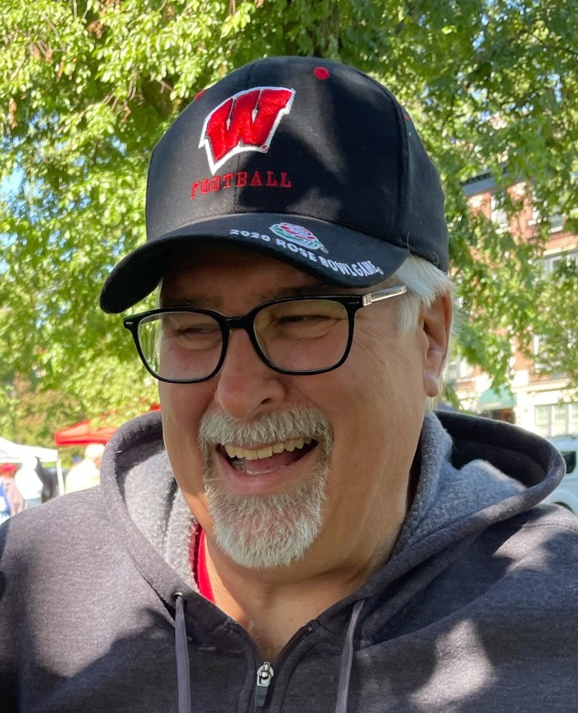

{fig-alt="BuffaloBadger logo" fig-align="center" width="600"}

{style="float: right;" fig-alt="Photo of Carl Lund" fig-align="right" width="350" style="margin: 10px"}

Hi! My name is Carl Lund. I'm a [Wisconsin Badger](https://uwbadgers.com) fan and [UW Chemical Engineering](https://engineering.wisc.edu/departments/chemical-biological-engineering/?utm_source=guide&utm_medium=contactLink) alum living in [Buffalo, NY](https://www.visitbuffaloniagara.com). I'm also a professor of [Chemical Engineering at the University at Buffalo](https://engineering.buffalo.edu/chemical-biological.html).

I have been teaching undergraduate reaction engineering for almost 40 years, during which I've continually revised my teaching methods and the resources I use. I created this site to share the *Reaction Engineering Basics* resources I have developed during that time with others. [*REB, The Book*](http://buffalobadger.github.io/RE_Basics) is the free, online textbook I wrote and use for teaching undergraduate reaction engineering. 

[*REB, The Course*](http://buffalobadger.github.io/RE_Basics_Course) is an online, self-study course that is tightly integrated with the book. I'm sharing it as a free resource for anyone who wants to learn about reaction engineering, but also to illustrate the teaching methods I've found to be particularly effective in helping students learn more easily and efficiently.

I have no formal training in education, but I have read a lot about it and have tried to apply what I've learned to my teaching. I have also been fortunate to have had some great mentors who have helped me learn how to teach better. In [*REB, The Design*](http://buffalobadger.github.io/RE_Basics_Design), I describe the design of *REB, The Course* and *REB, The Book* and the pedagogical principles that guided their development. I'm sharing this information in the hope that it will be useful to others who are interested in improving their teaching. The approach can easily be adapted to most problem-solving engineering and science courses.

I *do* have other interests, and [The BuffaloBadger's Sett](http://buffalobadger.github.io/The_Sett) is where I hope to talk, rant, and ramble on about things other than reaction engineering and engineering education.

Hope you get inspired or learn something while visiting here!

Horns Up and On Wisconsin!
