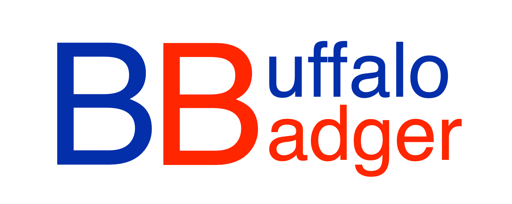
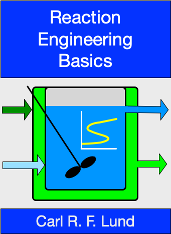
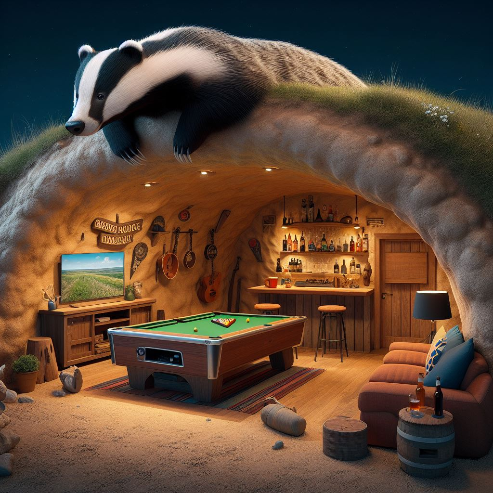

{fig-alt="BuffaloBadger logo" fig-align="center" width="600"}

## Reaction Engineering Basics (REB)

:::: {.columns}

::: {.column width="35%"}

[{style="margin: 10px" width="200" style="float: left;"}](http://buffalobadger.github.io/RE_Basics)

:::

::: {.column width="65%"}

[*REB, The Book*](http://buffalobadger.github.io/RE_Basics) is a textbook on reaction engineering, written for use in the undergraduate kinetics and reaction engineering course I teach.

[*REB, The Course*](http://buffalobadger.github.io/RE_Basics_Course) is an online, self-study course for learning reaction engineering at the undergraduate level. It is very similar to the course I teach in person, but it is designed to be used by students who are learning on their own, and you can't earn college credit by completing it.

*REB, The Course* and *REB, The Book* are designed to be used together and to provide an integrated platform for learning reaction engineering.

[*REB, The Design*](http://buffalobadger.github.io/RE_Basics_Design) describes the design of *REB, The Course* and *REB, The Book* and the pedagogical principles that guided their development.

:::

::::

## BuffaloBadger's Sett

:::: {.columns}

::: {.column width="35%"}

[{style="margin: 10px" width="200" style="float: left;"}](http://buffalobadger.github.io/The_Sett)

:::

::: {.column width="65%"}

Unlike Gophers, who live in holes, a Badger's home is called a sett. [BuffaloBadger's Sett](http://buffalobadger.github.io/The_Sett) is my online home where I post random thoughts about anything other than engineering and engineering education.

:::

::::

## License

This website is licensed under the [Creative Commons Attribution-Non-Commercial-NoDerivatives 4.0 International](https://creativecommons.org/licenses/by-nc-nd/4.0/) License (CC BY-NC-ND 4.0).